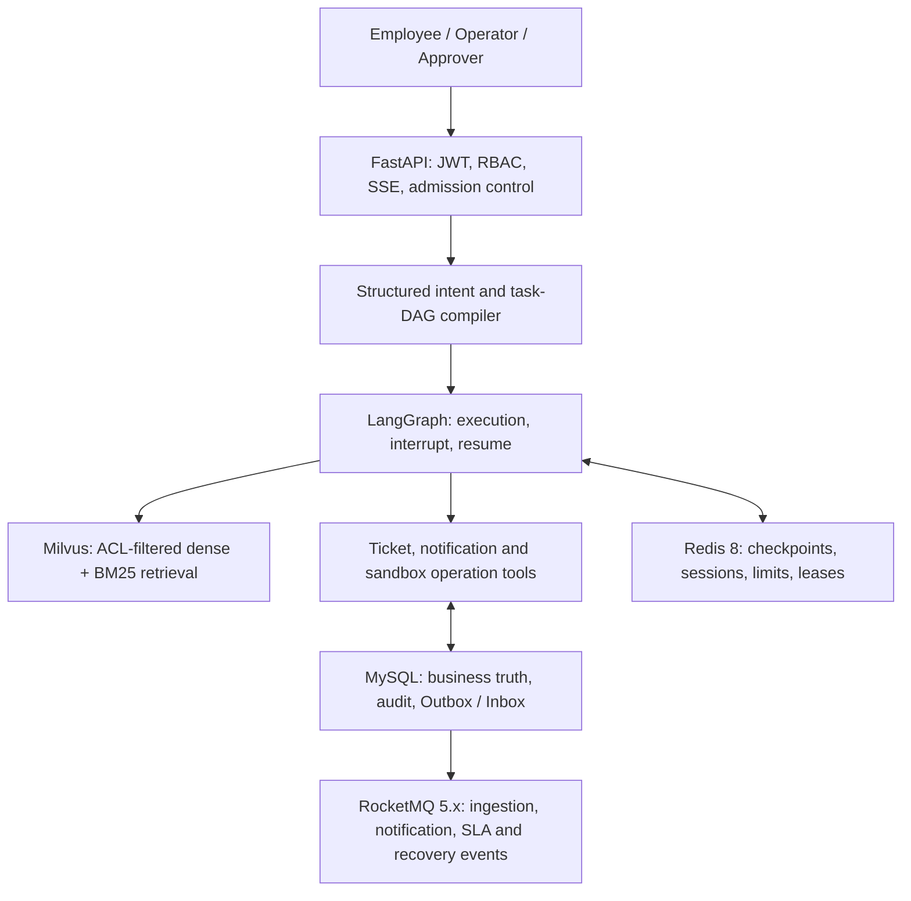

# KnowFlow Agent Platform

KnowFlow 是一个面向单企业多用户场景的企业知识与工单可靠执行 Agent 平台规划项目。
目标不是再做一个文档问答 Demo，而是把自然语言请求可靠地转换为知识检索、工单操作、
通知、人工审批和沙箱运维动作，并能在超时、中断、重复消息与多人并发下保持业务结果正确。

> 当前状态：项目规约、需求规格、架构设计、接口契约和实施任务已经完成；应用代码尚未实现。
> 所有性能、质量和简历数字均为待实测目标，不代表已经取得的结果。

## Flagship scenario

> 查询 RocketMQ 消息积压处理手册，创建一个 P1 工单并通知值班人员；调用消费者重启工具前，需要我审批。

这一条请求用于展示多意图拆解、权限过滤 RAG、工单幂等、可靠消息、人工审批、暂停恢复与故障处理。

## Planned architecture

The governing reliability statement is:

> Delivery is at least once; stable operation/message identities, MySQL constraints, Outbox/Inbox,
> optimistic versions and replay-safe tools prevent duplicated business effects.

## Specification documents

- [Project constitution](.specify/memory/constitution.md)
- [Feature specification](specs/001-knowflow-agent-platform/spec.md)
- [Implementation plan](specs/001-knowflow-agent-platform/plan.md)
- [Technical research](specs/001-knowflow-agent-platform/research.md)
- [Data model](specs/001-knowflow-agent-platform/data-model.md)
- [REST and SSE contract](specs/001-knowflow-agent-platform/contracts/openapi.yaml)
- [RocketMQ event contract](specs/001-knowflow-agent-platform/contracts/events.md)
- [Quickstart acceptance contract](specs/001-knowflow-agent-platform/quickstart.md)
- [121 implementation tasks](specs/001-knowflow-agent-platform/tasks.md)
- [41 interview questions and answers](KnowFlow_41道核心面试题_5分钟回答.md)

## Two-week MVP boundary

In scope:

- Python 3.12 end-to-end system
- Single enterprise with employee, operator, approver and administrator roles
- Permission-filtered cited knowledge answers
- Ticket create/query/update with optimistic concurrency
- Structured single/multi-intent planning and focused clarification
- Human approval with durable interrupt/resume
- MySQL Outbox/Inbox and RocketMQ at-least-once delivery
- Fault injection, quality evaluation and controlled-load evidence

Explicitly out of scope:

- Multi-tenant SaaS claims
- Kubernetes or production-scale deployment claims
- Arbitrary tool execution or autonomous multi-agent teams
- Model fine-tuning and full benchmark-corpus ingestion
- Unmeasured resume metrics or transport-level exactly-once claims

## Analysis status

The latest read-only Spec Kit analysis found no constitutional or CRITICAL issue and mapped all
30 functional requirements plus 10 success criteria to implementation tasks. Before implementation,
the plan should still resolve five HIGH-priority gaps: document-version/retry API contracts, audit
query contract, operator recovery contract, notification-state visibility, and a measurable scripted
usability protocol.

## Next workflow

1. Amend the specification/contracts/tasks for the analysis findings.
2. Rerun `$speckit-analyze`.
3. Execute `$speckit-implement` story by story, preserving test and measurement evidence.

No license has been selected yet. Unless a license is added, normal copyright restrictions apply.
